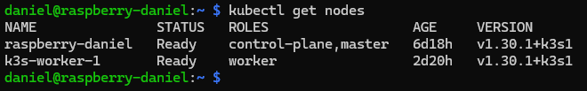
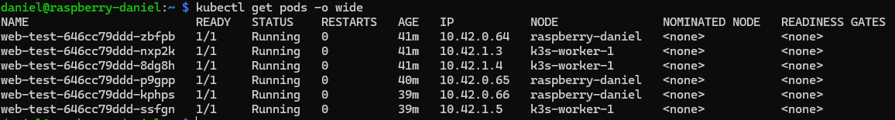
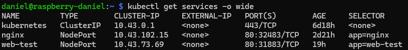

# Kubernetes Role

This Ansible role installs K3s and deploys Kubernetes workloads to a hybrid cluster composed of Raspberry Pi (ARM) and x86_64 nodes.

## Features

- Installs [K3s](https://k3s.io/) on master and worker nodes
- Supports mixed architecture clusters (ARM + x86_64)
- Deploys pods and services defined in [`group_vars/kubernetes.yml`](../../group_vars/kubernetes.yml)
- Uses GitHub Secrets for secure token management
- Compatible with GitHub Actions and local execution

## Requirements

- Raspberry Pi and/or x86_64 nodes with SSH access
- Ansible installed locally or in CI/CD
- Kubernetes collection: `ansible-galaxy collection install kubernetes.core`
- GitHub Secret named `K3S_TOKEN`
- (Optional) Python virtual environment with required packages

## Variables

Defined in `group_vars/kubernetes.yml`:

```yaml
k3s_version: "v1.30.1+k3s1"

k3s_token: "{{ lookup('env', 'K3S_TOKEN') }}"

kubeconfig_path: ~/.kube/config

master_node: raspberry-daniel
worker_nodes:
  - k3s-worker-1

kubernetes_pods:
  - name: web-test
    image: nginx
    replicas: 4
    namespace: default

kubernetes_services:
  - name: web-test
    type: NodePort
    port: 80
    targetPort: 80
```
---

## Usage
1. Export the K3s token
```bash
export K3S_TOKEN=$(cat /var/lib/rancher/k3s/server/node-token)
ansible-playbook setup.yml
```
2. Run the playbook
```bash
ansible-playbook setup.yml
```
3. (Optional) Run specific tags
```bash
ansible-playbook setup.yml --tags k3s,workloads
```
---

## Screenshots

# Cluster node
- 

# Pods distribution
- 

# Services Exposed
- 

---

## Notes
- This role is part of a modular infrastructure managed via Ansible.
- Designed for edge computing and homelab setups.
- Compatible with heterogeneous clusters and lightweight deployments.