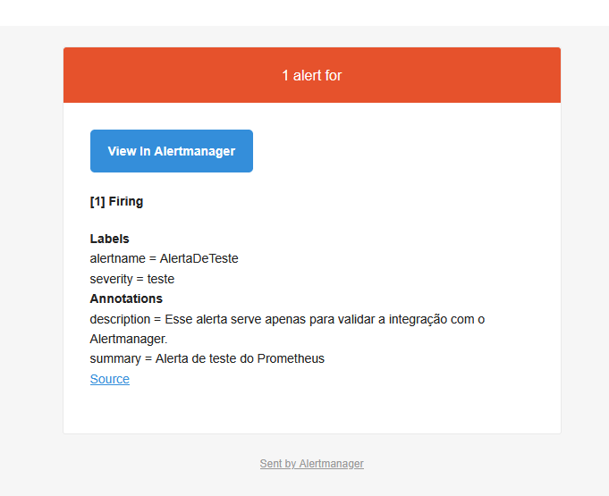
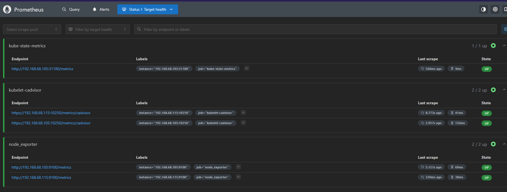
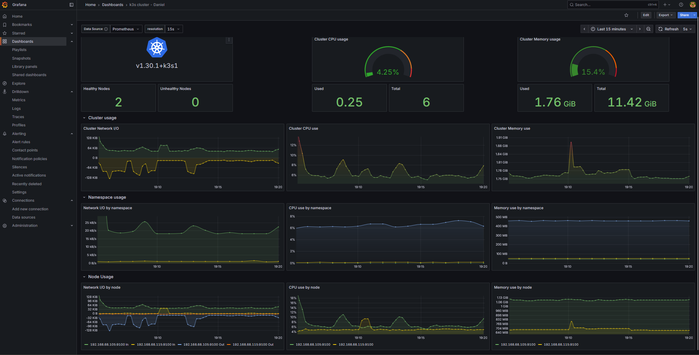
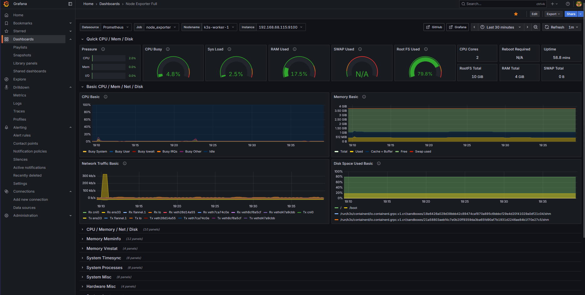

# Phase 3 – Monitoring & Observability

## Overview
This phase introduces a complete observability stack for the K3s cluster, combining:
- **Prometheus** – metric collection and storage
- **Node Exporter** – node-level metrics
- **Alertmanager** – alert routing and notifications
- **Grafana** – visualization and dashboards

The goal is to provide real‑time visibility into cluster health, performance, and events, with proactive alerting.

---

## Architecture

```text
[Node Exporter] --->+
                    |
[Prometheus] <------+--> [Alertmanager] --> [Notification Channels]
      |
      +--> [Grafana Dashboards]
```

---

## Installation & Configuration
Prerequisites:
- Ansible ≥ 2.9
- SSH access to all target nodes
- Vault password for encrypted variables

### Tags in this phase
- `monitoring` - Installs Prometheus, Node Exporter, Alertmanager

### Deploying to the cluster

Example:
```bash
ansible-playbook setup.yml \
  -i hosts.ini \
  --tags monitoring \
  --ask-vault-pass
```
You can limit execution to a specific host for testing:
```bash
ansible-playbook setup.yml \
  -i hosts.ini \
  --tags monitoring \
  --ask-vault-pass \
  --limit k3s-worker-1
```
---

## Role Structure
`roles/monitoring`
- `vars/main.yml`: central variables (e.g., Alertmanager host/port)
- `templates/prometheus.yml.j2`: main Prometheus config (alerting + rule_files)
- `templates/rules/*.yml`: alert rules
- `tasks/prometheus.yml`: setup and restart logic for Prometheus
(future) tasks for Grafana integration

---

## Alerting
### Default Test Rule
A commented “test alert” file (`teste.yml.j2`)is deployed by default in `/etc/prometheus/rules/`
Uncomment to perform a smoke test of the Prometheus → Alertmanager pipeline.

### Manual Quick Test (No Ansible)
Create `/etc/prometheus/rules/always_firing.yml`:
```yaml
groups:
  - name: temp-test
    rules:
      - alert: AlwaysFiring
        expr: vector(1)
        for: 1m
        labels:
          severity: none
        annotations:
          summary: "Temporary test alert"
          description: "Smoke test for Prometheus → Alertmanager integration"
```
Reload Prometheus:
```bash
sudo systemctl restart prometheus
```
Remove when done:
```bash
sudo rm /etc/prometheus/rules/always_firing.yml
```

---

## Validation Steps
After deployment:
1. Access Prometheus UI → Status → Targets – all endpoints UP
2. **Status → Configuration** - Alertmanager listed under `alerting`
3. Alertmanager UI – alerts received as expected
4. Grafana – dashboards rendering metrics

---

## Grafana Integration
- Grafana is now fully implemented via Ansible:
- Prometheus datasource pre‑configured
- Automatic import of:
    - `Node Exporter Full` dashboard
    - `K8s Cluster Monitoring` dashboard
- Service enabled and started
- Accessible at: `http://<grafana_host>:3000` (default admin/admin – change password after first login)

---

## Troubleshooting
- **Alert not firing**: Ensure the rule file is loaded (`rule_files` in `prometheus.yml`) and reload Prometheus.
- **Alertmanager unreachable**: Check network connectivity and matching host/port in `vars/main.yml`.
- **Grafana dashboard empty**: Verify Prometheus datasource is healthy in Grafana Configuration → Data Sources.

---
## Screenshots
### Alert Manager
- 

### Prometheus Targets
- 

### Grafana Dashboards
### Kubernetes Cluster
- 

### Node Exporter
- 

---

## 📅 Change Log
- 2025‑08‑19: Grafana fully implemented with pre‑loaded dashboards
- 2025‑08‑12: Added Prometheus, Alertmanager, and initial alert rules
